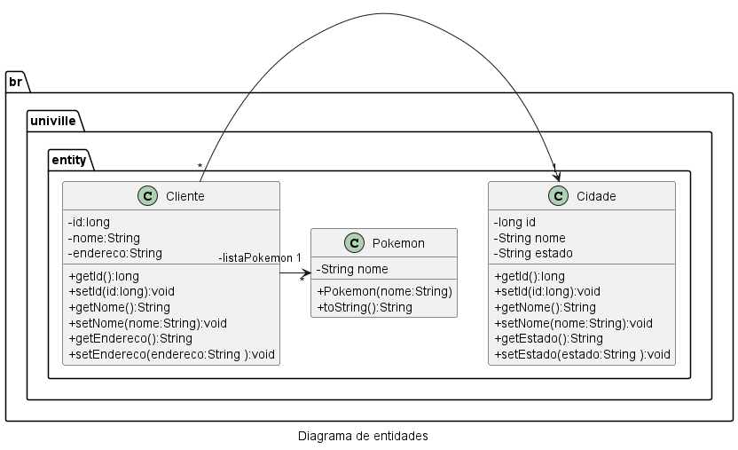
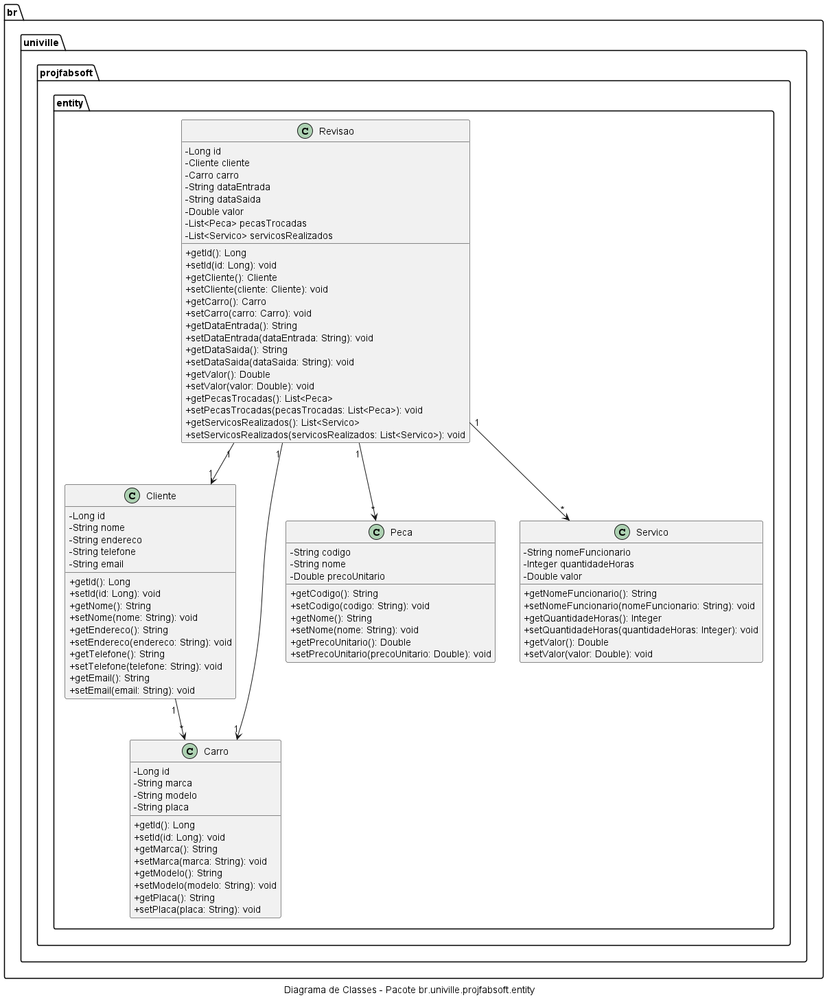

# Fábrica de Software 2025/1

## Repositório dos alunos
- [Repos](https://gist.github.com/d4e37df9f6772173110603fc8bf90b84.git)

## Propostas de projeto

- Nome do sistema Ex:(Sistema para Mecânica)
  - Funcionalidade 1
  - Funcionalidade 2
  - Funcionalidade 3

<s>

- Nome do sistema Ex:(Sistema para Mecânica)
  - Funcionalidade 1
  - Funcionalidade 2
  - Funcionalidade 3

</s>


## Livro Eng Software Moderna
[Eng. Soft Moderna - Requisitos](https://engsoftmoderna.info/cap3.html)

## Histórias de Usuário
- Como um Atendente eu gostaria de registrar os dados do cliente como: nome, endereço, telefone, email
- Como um Atendente eu gostaria de registrar os dados do Carro do cliente como: marca, modelo, placa
- Como um Atendente eu gostaria de vincular o Carro ao Cliente
- Como um Atedente eu gostaria de agendar uma revisão com os seguintes dados: cliente, carro, data entrada, data saida, valor da revisão
- Como um Atendente eu gostaria de vincular peças trocadas na revisão com os seguintes dados: codigo, nome, preço unitário
- Como um Atendente eu gostaria de vincular os serviços de mão de obra realizados na revisão com os seguintes dados: nome do funcionário, quantidade de horas, valor


## Comandos do Git

### Instalação
[Git Bash](https://git-scm.com/downloads)

### Configuração inicial

```
git config --global user.name "NOME DO USUARIO NO GITHUB"
git config --global user.email "EMAIL DA CONTA DO GITHUB"
```
### Tipos de mensagens do commit

- feat: (new feature for the user, not a new feature for build script)
- fix: (bug fix for the user, not a fix to a build script)
- docs: (changes to the documentation)
- style: (formatting, missing semi colons, etc; no production code change)
- refactor: (refactoring production code, eg. renaming a variable)
- test: (adding missing tests, refactoring tests; no production code change)
- chore: (updating grunt tasks etc; no production code change)

### Commit e Push

```
git add .
git commit -m "tipo: o que foi feito"
git push -u origin main
```

### Ambiente de desenvolvimento JAVA
[Eclipse Adoptium](https://adoptium.net/)
[Microsoft OpenJDK](https://www.microsoft.com/openjdk)
[AWS CORRETTO](https://aws.amazon.com/pt/corretto/)
[VSCode](https://code.visualstudio.com/download)
[Extension Pack for Java](https://marketplace.visualstudio.com/items?itemName=vscjava.vscode-java-pack)


- JRE - Java Runtime Environment
   - Java Virtual Machine JVM 
     - java.exe / javaw.exe
- JDK - Java Development Kit
  - Compilar o java (javac.exe)

## Diagrama de classes



## Prompts Aula 01/04/2025
- Encontrar as entidades nas histórias de usuário
```bash
@workspace #sym:## Histórias de Usuário quais são as entidades
```
- Gerar as classes java das entidades
```bash
@workspace por favor, crie as classe em java no pacote entity para representar as entidades
```
- Gerar o Diagrama de Classes de Entidade (Domínio)
```bash
@workspace por favor gere um diagrama uml no padrão plantuml das classes do pacote br.univille.projfabsoft
```
- Instalar a extensão [PlantUML](https://marketplace.visualstudio.com/items?itemName=jebbs.plantuml)

## Diagrama de classes Entidade (Domínio)


